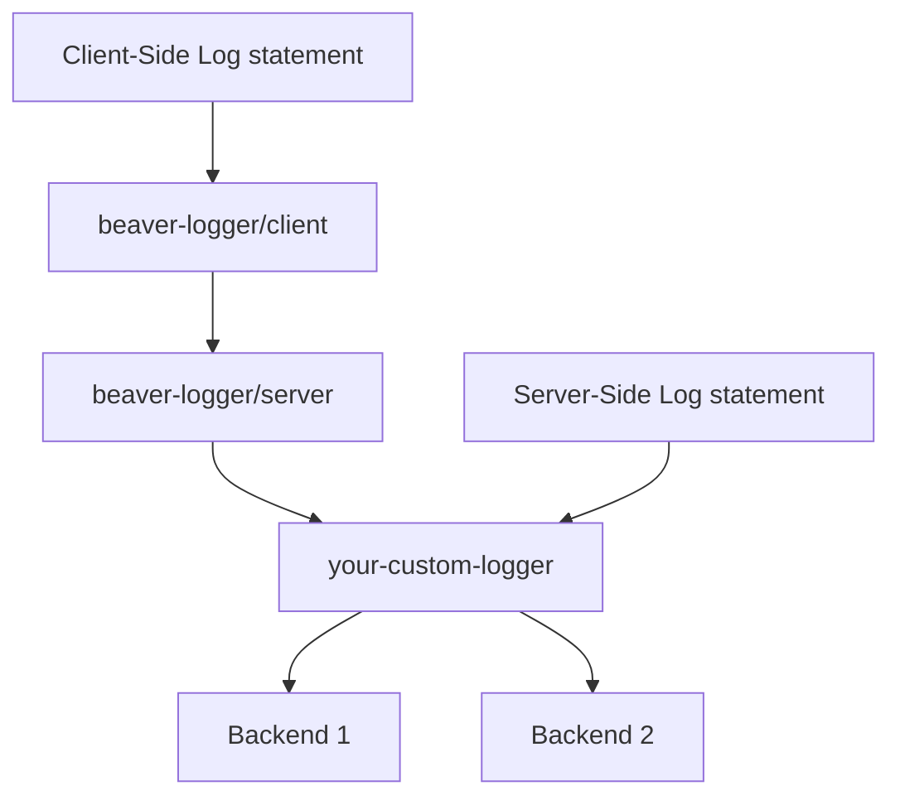

## beaver-logger

[![build status][build-badge]][build]
[![code coverage][coverage-badge]][coverage]
[![npm version][version-badge]][package]

[build-badge]: https://img.shields.io/github/actions/workflow/status/krakenjs/beaver-logger/main.yml?branch=main&logo=github&style=flat-square
[build]: https://github.com/krakenjs/beaver-logger/actions?query=workflow:build
[coverage-badge]: https://img.shields.io/codecov/c/github/krakenjs/beaver-logger.svg?style=flat-square
[coverage]: https://codecov.io/github/krakenjs/beaver-logger/
[version-badge]: https://img.shields.io/npm/v/@krakenjs/beaver-logger.svg?style=flat-square
[package]: https://www.npmjs.com/package/@krakenjs/beaver-logger

Front-end logger, which will:

- Buffer your front-end logs and periodically send them to the server side
- Automatically flush logs for any errors or warnings

This is a great tool to use if you want to do logging on the client side in the same way you do on the server, without worrying about sending off a million beacons. You can quickly get an idea of what's going on on your client, including error cases, page transitions, or anything else you care to log!

## Overview

## Setup

```javascript
var $logger = beaver.Logger({
  url: "/my/logger/url",
});
```

## Basic logging

### `$logger.info(<event>, <payload>);`

Queues a log. Options are `debug`, `info`, `warn`, `error`.

For example:

`$logger.error('something_went_wrong', { error: err.toString() })`

### `$logger.track(<payload>);`

Call this to attach general tracking information to the current page. This is useful if the data is not associated with a specific event, and will be sent to the server the next time the logs are flushed.

### `$logger.metricCounter(<event>, <payload>);`

Queues a counter metric, helper wrapping `logger.metric`

```
logger.metricCounter({
  namespace: "pp.team.product.feature",
  event: "button_click",
  dimensions: {
    type: "paypal"
  }
})
```

#### Using a namespace prefix

```
const logger = new Logger({...options, metricNamespacePrefix: "company.team.app"})

logger.metricCounter({
  namespace: "product.feature",
  event: "button_click",
})

// creates metric with namespace of
// company.team.app.product.feature
```

### `$logger.metricGauge(<event>, <payload>);`

Queues a gauge metric, helper wrapping `logger.metric`

```
logger.metricGauge({
  namespace: "pp.team.product.feature",
  event: "request_latency",
  value: 100,
  dimensions: {
    method: "GET"
  }
})
```

#### Using a namespace prefix

```
const logger = new Logger({...options, metricNamespacePrefix: "company.team.app"})

logger.metricGauge({
  namespace: "product.feature",
  event: "request_latency",
  value: 100
})

// creates metric with namespace of
// company.team.app.product.feature
```

### Deprecated - `$logger.metric(<event>, <payload>);`

Queues a metric. We suggest using the `metricCount` or `metricGauge` interface for better type safety and clearer intention in your code.

## Advanced

### `$logger.addMetaBuilder(<function>);`

Attach a method which is called and will attach general information to the logging payload whenever the logs are flushed

```javascript
$logger.addMetaBuilder(function () {
  return {
    current_page: getMyCurrentPage(),
  };
});
```

### `$logger.addMetricDimensionBuilder(<function>);`

Attach a method which is called and will attach values to **each metric's dimensions** whenever the logs are flushed

```javascript
$logger.addMetricDimensionBuilder(() => ({
  token_used: true,
  type: "user_id_token",
}));
```

### `$logger.addPayloadBuilder(<function>);`

Attach a method which is called and will attach values to **each individual log's payload** whenever the logs are flushed

```javascript
$logger.addPayloadBuilder(function () {
  return {
    performance_ts: window.performance.now(),
  };
});
```

### `$logger.addTrackingBuilder(<function>);`

Attach a method which is called and will attach values to **each individual log's tracking** whenever the logs are flushed

```javascript
$logger.addTrackingBuilder(function () {
  return {
    pageLoadTime: getPageLoadTime(),
  };
});
```

### `$logger.addHeaderBuilder(<function>);`

Attach a method which is called and will attach values to **each individual log requests' headers** whenever the logs are flushed

```javascript
$logger.addHeaderBuilder(function () {
  return {
    "x-csrf-token": getCSRFToken(),
  };
});
```

### `$logger.flush();`

Flushes the logs to the server side. Recommended you don't call this manually, as it will happen automatically after a configured interval.

## Installing

- Install via npm

`npm install --save beaver-logger`

- Include in your project

```html
<script src="/js/beaver-logger.min.js"></script>
```

or

```javascript
let $logger = require("beaver-logger");
```

## Configuration

Full configuration options:

```javascript
var $logger = beaver.Logger({
  // Url to send logs to
  url: "/my/logger/url",

  // Prefix to prepend to all events
  prefix: "myapp",

  // Log level to display in the browser console
  logLevel: beaver.LOG_LEVEL.WARN,

  // Interval to flush logs to server
  flushInterval: 60 * 1000,

  // Use sendBeacon if supported rather than XHR to send logs; defaults to false
  enableSendBeacon: true,
});
```

## Server Side

beaver-logger includes a small node endpoint which will automatically accept the logs sent from the client side. You can mount this really easily:

```javascript
let beaverLogger = require("beaver-logger/server");

myapp.use(
  beaverLogger.expressEndpoint({
    // URI to recieve logs at
    uri: "/api/log",

    // Custom logger (optional, by default logs to console)
    logger: myLogger,

    // Enable cross-origin requests to your logging endpoint
    enableCors: false,
  })
);
```

Or if you're using kraken, you can add this in your `config.json` as a middleware:

```json
      "beaver-logger": {
          "priority": 106,
          "module": {
              "name": "beaver-logger/server",
              "method": "expressEndpoint",
              "arguments": [
                  {
                      "uri": "/api/log",
                      "logger": "require:my-custom-logger-module"
                  }
              ]
          }
      }
```

## Custom backend logger

Setting up a custom logger is really easy, if you need to transmit these logs to some backend logging service rather than just logging them to your server console:

```javascript
module.exports = {
  log: function (req, level, event, payload) {
    logSocket.send(
      JSON.stringify({
        level: level,
        event: event,
        payload: payload,
      })
    );
  },
};
```

## Data Flow


